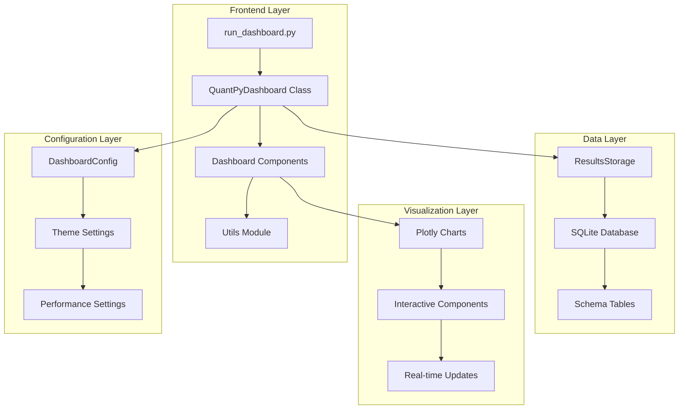
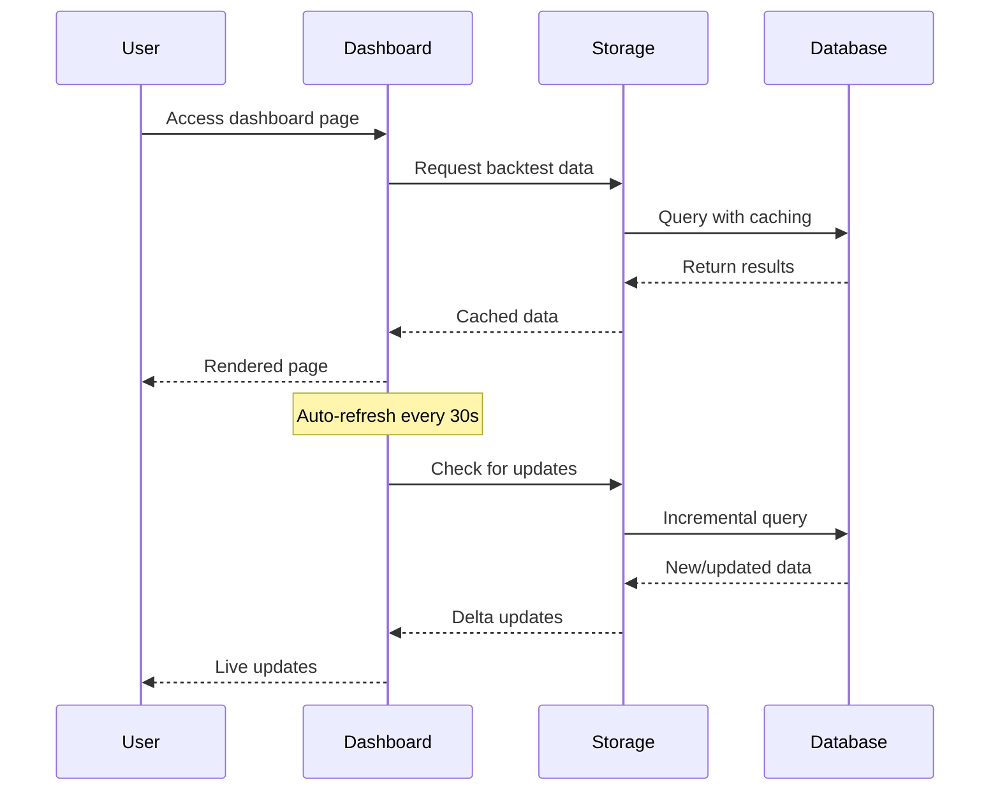

# Dashboard Architecture Overview

## System Architecture

The QuantPyTrader dashboard follows a modular, component-based architecture designed for scalability, maintainability, and performance.



## Component Architecture

### 1. Entry Point Layer
- **run_dashboard.py**: Main launcher with environment setup
- **dashboard_app.py**: Core application logic and routing
- **initialize_dashboard.py**: Database initialization and demo data

### 2. Configuration Layer
```python
@dataclass
class DashboardConfig:
    page_title: str = "QuantPyTrader Dashboard"
    page_icon: str = "📈"
    layout: str = "wide"
    auto_refresh: bool = True
    refresh_interval: int = 30
    colors: Dict[str, str] = field(default_factory=dict)
```

### 3. Component Layer
- **MetricsCard**: Key performance indicators display
- **PerformanceChart**: Portfolio and strategy visualizations
- **TradeAnalysis**: Trade timeline and P&L analysis
- **RegimeDisplay**: Market regime probability visualization
- **StrategyComparison**: Multi-strategy comparison tools
- **RiskMetrics**: Risk analysis and VaR calculations

### 4. Utility Layer
- **Formatting Functions**: Currency, percentage, ratio formatting
- **Data Loading**: Cached data retrieval with TTL
- **Performance Calculations**: Strategy rankings and comparisons
- **Export Functions**: Multi-format data export capabilities

### 5. Storage Layer
- **ResultsStorage**: Database abstraction layer
- **Schema Management**: 15+ table schema with relationships
- **State Persistence**: Kalman filter state serialization
- **Performance Optimization**: Connection pooling and caching

## Data Flow Architecture



## Database Schema Design

### Core Tables Relationship
```sql
-- Strategy definitions
strategies (id, name, strategy_type, parameters, created_at)
    ↓ 1:N
-- Backtest sessions
backtests (id, strategy_id, name, start_date, end_date, status)
    ↓ 1:N
-- Portfolio snapshots (time-series)
portfolio_snapshots (id, backtest_id, timestamp, total_value, cash)
    ↓ 1:N
-- Individual trades
trades (id, backtest_id, symbol_id, entry_timestamp, entry_price, exit_price)
    ↓ 1:1
-- Performance summary
performance_summary (backtest_id, total_return, sharpe_ratio, max_drawdown)
```

### BE-EMA-MMCUKF Specific Tables
```sql
-- Kalman filter states (serialized)
kalman_states (id, backtest_id, timestamp, state_vector, covariance_matrix)
    ↓ 1:N
-- Market regime probabilities
market_regimes (id, backtest_id, timestamp, bull_prob, bear_prob, dominant_regime)
    ↓ 1:N
-- Regime transitions
regime_transitions (id, backtest_id, timestamp, from_regime, to_regime, probability)
```

## Performance Architecture

### Caching Strategy
```python
# Data caching with TTL
@st.cache_data(ttl=60)
def load_dashboard_data(storage_path: str = None) -> Dict[str, Any]:
    # Cache dashboard data for 1 minute

@st.cache_data(ttl=300)  
def get_market_data_sample() -> pd.DataFrame:
    # Cache market data for 5 minutes
```

### Resource Optimization
- **Memory Management**: Efficient DataFrame operations with Pandas/Polars
- **Database Connections**: Context manager pattern for automatic cleanup
- **UI Updates**: Selective re-rendering with Streamlit's state management
- **Chart Performance**: Plotly optimization for large datasets

### Scalability Considerations
- **Connection Pooling**: SQLite with WAL mode for concurrent reads
- **Data Pagination**: Large result set handling with limit/offset
- **Asynchronous Operations**: Background data loading capabilities
- **State Management**: Session state for user-specific configurations

## Security Architecture

### Data Protection
- **SQL Injection Prevention**: Parameterized queries throughout
- **Input Validation**: All user inputs validated and sanitized
- **Error Handling**: Graceful error handling without information leakage
- **Resource Limits**: Query timeouts and result size limits

### Access Control
- **Environment Isolation**: Virtual environment for dependency management
- **File Permissions**: Restricted access to database and configuration files
- **Session Management**: Streamlit's built-in session handling
- **Audit Trail**: Logging of significant operations and errors

## Testing Architecture

### Test Coverage
```python
# Component testing
def test_dashboard_components():
    # Test utility functions
    # Test formatting functions
    # Test configuration handling

# Database testing  
def test_database_creation():
    # Test schema creation
    # Test sample data insertion
    # Test data retrieval

# Export testing
def test_export_functionality():
    # Test CSV export
    # Test JSON export
    # Test Excel export
```

### Health Monitoring
```python
# Automated health checks
def run_health_check():
    checks = [
        ("Python Version", check_python_version),
        ("Virtual Environment", check_virtual_env),
        ("Dependencies", check_dependencies),
        ("Database", check_database),
        ("Dashboard Files", check_dashboard_files),
        ("Configuration", check_dashboard_config),
        ("Components", check_dashboard_components)
    ]
```

## Deployment Architecture

### Local Development
```bash
# Development setup
source .venv/bin/activate
python initialize_dashboard.py
streamlit run run_dashboard.py
```

### Production Considerations
```bash
# Production deployment
streamlit run run_dashboard.py --server.port 8501 --server.address 0.0.0.0
```

### Docker Containerization (Future)
```dockerfile
FROM python:3.11-slim
WORKDIR /app
COPY requirements.txt .
RUN pip install -r requirements.txt
COPY . .
EXPOSE 8501
CMD ["streamlit", "run", "run_dashboard.py"]
```

## Integration Points

### External Systems
- **Alpha Vantage API**: Market data integration
- **Polygon.io API**: Real-time data feeds  
- **FRED API**: Economic indicators
- **Broker APIs**: Live trading integration (Alpaca, IBKR)

### Internal Components
- **Backtesting Engine**: Results data source
- **Kalman Filter System**: State data and regime probabilities
- **Risk Management**: VaR calculations and position sizing
- **Export System**: Multi-format report generation

## Future Enhancements

### Planned Architectural Improvements
1. **Microservices Architecture**: Separate data, compute, and UI services
2. **Real-time Data Streaming**: WebSocket integration for live updates
3. **Caching Layer**: Redis for distributed caching
4. **Load Balancing**: Multiple dashboard instances behind a load balancer
5. **Message Queue**: Asynchronous job processing with Celery/RQ

### Scalability Roadmap
1. **Phase 1**: Current SQLite-based architecture (✅ Completed)
2. **Phase 2**: PostgreSQL migration for better concurrency
3. **Phase 3**: Distributed architecture with message queues
4. **Phase 4**: Cloud-native deployment with Kubernetes

## Technical Specifications

### Performance Metrics
- **Page Load Time**: < 2 seconds for initial load
- **Chart Rendering**: < 500ms for interactive charts
- **Database Queries**: < 100ms for most operations
- **Memory Usage**: < 512MB for typical operation
- **Concurrent Users**: Supports 10+ simultaneous users

### Browser Compatibility
- **Chrome**: 90+ (Recommended)
- **Firefox**: 88+
- **Safari**: 14+
- **Edge**: 90+

### System Requirements
- **Python**: 3.11.13+
- **RAM**: 4GB minimum, 8GB recommended
- **Storage**: 1GB for full installation
- **Network**: HTTP/HTTPS for external API access

## Documentation Standards

### Code Documentation
- **Docstrings**: All functions and classes documented
- **Type Hints**: Full type annotation coverage
- **Comments**: Inline comments for complex logic
- **README**: Comprehensive setup and usage instructions

### Architecture Documentation
- **System Diagrams**: Mermaid diagrams for visual representation
- **API Documentation**: Auto-generated from docstrings
- **Database Schema**: ER diagrams and table descriptions
- **Deployment Guides**: Step-by-step deployment instructions

This architecture supports the current needs while providing a foundation for future scalability and enhancements.